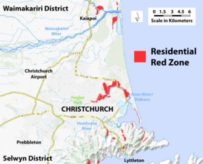

Christchurch’s transition to local leadership takes a big step forward today, with the management of about 6,000 red zone properties transferring from Land Information New Zealand (LINZ) to Christchurch City Council (CCC) 
CCC is now responsible for managing Crown-owned residential red zone land in flatland areas – Brooklands, Southshore/South New Brighton and the Ōtākaro Avon River Corridor. LINZ will continue to manage the Port Hills red zone.

This means CCC is now the contact for red zone flatlands maintenance, plant and animal pest management, security, traffic management, land access and permanent land use.

LINZ CE Gaye Searancke says the flatlands management transfer is the culmination of nine years’ work, and CCC and LINZ have worked closely over recent months to ensure a smooth transition.

“We’ve covered a lot of uncharted territory since taking over responsibility for the Crown-owned red zone land  in 2015 – continuing the work started by the Canterbury Earthquake Recovery Authority.

“Since then, we’ve coordinated the demolition of about 300 houses, cleared and grassed thousands of properties and been responsible for keeping 7,700 properties safe and secure.

“We’ve also supported the local community’s activation of this area, through facilitating more than 130 transitional land use projects. LINZ will continue to be the first port of call for these temporary land uses, until we transfer ownership of the land.”
 

Under the 2019 Global Settlement Agreement, the ownership and management of Crown-owned red zone land is being progressively transferred from the Crown to CCC. The transfer of flatland management is the first step in this process, with ownership transferring separately in bundles over the next year.
 
“This is a major milestone and I’m proud of how we’ve looked after this land that is about four times the size of Christchurch’s Hagley park,” Ms Searancke says.

“It’s now a park-like area that has the potential to become a true asset for the city and something all Cantabrians can be proud of.”
