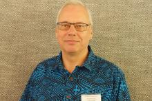

NZ National Hydrographer appointed Chair of South West Pacific Hydrographic Commission. 

LINZ’s National Hydrographer Adam Greenland has been appointed to the role of Chair of the South West Pacific Hydrographic Commission (SWPHC).

As SWPHC Chair, last held by a New Zealander 12 years ago, Adam will lead the Commission’s work which includes ensuring the delivery of the International Hydrographic Organisation’s work programme through to disaster management preparedness, marine environment protection, safety at sea and promoting the blue economy.

Adam will hold the role for a 3 year term which commenced on 1 July.

South West Pacific Hydrographic Commission(https://iho.int/en/swphc)

International Hydrographic Organisation’s work programme(https://iho.int/en/iho-work-programme-and-management-plan)

