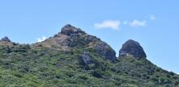

Dual place names for Banks Peninsula announced 

Minister for Land Information Hon. Eugenie Sage announced 13 official place names for Banks Peninsula at Rāpaki Marae yesterday, 11 of which are to be dual named.

“I am pleased to confirm the proposals from Te Hapū o Ngāti Wheke (Rāpaki Rūnanga) to Ngā Pou Taunaha o Aotearoa | the New Zealand Geographic Board to restore original Māori names and reflect Māori history in the area,” said Eugenie Sage.

“Māori place names now sit alongside well-known and established place names around Lyttelton Harbour/Whakaraupō including those of many iconic features along the skyline.

“Restoring traditional Rāpaki place names alongside English place names recognises the history and significance of these places,” said Eugenie Sage.

Ngā Pou Taunaha o Aotearoa | the New Zealand Geographic Board will publish the new official place names in the New Zealand Gazette(link is external) today.

Read the Minister’s media statement(link is external)

List of newly official place names for Banks Peninsula
Official Name	Former Name
Aua / King Billy Island	King Billy Island
Kaitangata / Mansons Peninsula	Mansons Peninsula
Ōmawete / Coopers Knob	Coopers Knob
Ōrongomai / Cass Peak	Cass Peak
Pukeatua / Dyers Pass	Dyers Pass
Tapuwaeharuru / Evans Pass	Evans Pass
Te Ahi-a-Tamatea	Rapaki Rock
Te Heru-o-Kahukura / Sugarloaf	Sugarloaf
Te Moenga-o-Wheke / The Tors	The Tors
Te Piaka / Adderley Head	Adderley Head
Te Tihi-o-Kahukura / Castle Rock	Tihiokahukura / Castle Rock
Te Rāpaki-o-Te Rakiwhakaputa	Rapaki
Te Upoko-o-Kurī / Witch Hill	Witch Hill